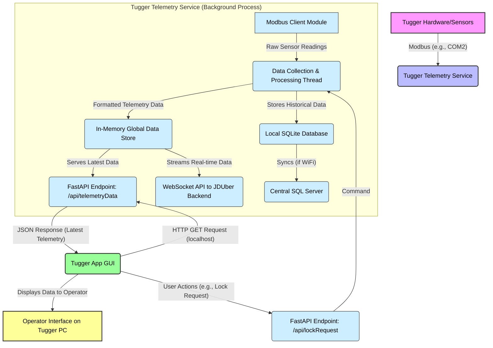

# 🚜 CQ Tugger Telemetry

This project encompasses the software running on tugger PCs to collect telemetry data and provide a user interface for operators. The primary goals are:

*   Calculate Overall Equipment Effectiveness (OEE) for tuggers.
*   Visualize operator routes.
*   Generate heatmaps to optimize route distribution.
*   Integrate with the "JDUber" project for dynamic, optimized route assignments.

## Project Structure

*   **🖥️ [Tugger App](Tugger App/README.md):** Contains the code for the graphical user interface (GUI) application that runs on the tugger PC. This application handles operator interactions, such as unlocking the tugger via employee badge scanning and potentially managing features like the rear-view camera display.
*   **🛰️ [Tugger Telemetry](Tugger Telemetry/README.md):** Contains the code for the background service responsible for collecting telemetry data (GPS, speed, status, etc.) directly from the tugger hardware. It stores this data locally, synchronizes it with a central SQL server, and transmits data in real-time to a WebSocket API (e.g., JDUber backend) for live monitoring. This component now integrates the functionalities of the previous "Tugger Telemetry" and "Tugger API" services.

## Data Flow: Tugger Hardware to Tugger App

The following diagram illustrates the data flow from the tugger's hardware, through the "Tugger Telemetry" service, and finally to the "Tugger App" GUI.

**Flow Explanation:**

1.  **Hardware Interaction:**
    *   The **Tugger Telemetry Service** initializes a Modbus client (`Tugger Telemetry/util/util.py:initModbusClient`).
    *   This client communicates directly with the **Tugger Hardware/Sensors** (e.g., GPS module, status indicators) over a serial connection (typically COM2, as seen in `initModbusClient` default).
    *   Raw data is read from specific Modbus registers (defined in `Tugger Telemetry/globals.py` like `SLAVE_GPS`, `SLAVE_STATUS`).

2.  **Data Collection & Processing:**
    *   The `threadSaveTelemetryData` in `Tugger Telemetry/util/threads.py` periodically:
        *   Ensures the Modbus connection is active (`ensureModbusConnection`).
        *   Retrieves all relevant data from the hardware using functions like `getAllData` (which internally calls `getGPSData`, `getStatusData` from `Tugger Telemetry/util/util.py`).
        *   This raw data is then parsed, formatted, and enriched with metadata (e.g., timestamp, tugger ID).
        *   The most recent processed telemetry data is stored in an **In-Memory Global Data Store** (`DATA_STORE.set("latestData", ...)` in `Tugger Telemetry/globals.py` and `Tugger Telemetry/main.py`).

3.  **Data Persistence and External Sync:**
    *   **Local Storage:** The processed telemetry data is saved to a **Local SQLite Database** (`insertLocalTelemetry` in `Tugger Telemetry/database/localQueries.py`). This ensures data isn't lost if the network connection drops.
    *   **Central SQL Server Sync:** If a Wi-Fi connection is available (`isWifiConnected`), the locally stored data is synchronized with a **Central SQL Server** (`insertServerTelemetryData` in `Tugger Telemetry/database/serverQueries.py`).
    *   **Real-time to JDUber:** The `threadWebsocketAPI` (in `Tugger Telemetry/util/threads.py`) takes the latest data from the Global Data Store and transmits it in real-time via WebSocket to the **JDUber Backend API** (`connectServers` in `Tugger Telemetry/util/api.py`).

4.  **Making Data Available to Tugger App:**
    *   The **Tugger Telemetry Service** runs a FastAPI web server (defined in `Tugger Telemetry/main.py`).
    *   One of its endpoints, `/api/telemetryData` (`telemetryGET` function), is designed to serve the latest telemetry data. This endpoint retrieves the data directly from the **In-Memory Global Data Store**.

5.  **Tugger App Data Retrieval:**
    *   The **Tugger App GUI** (running as a separate process) makes an HTTP GET request to the local FastAPI endpoint `http://127.0.0.1:5000/api/telemetryData` (URL defined in `Tugger Telemetry/globals.py` as `TELEMETRY_API_URL`).
    *   The FastAPI server (part of the Tugger Telemetry service) responds with a JSON object containing the latest telemetry data.

6.  **Display and Interaction:**
    *   The **Tugger App GUI** parses the JSON response and displays the relevant information (e.g., GPS location, speed, tugger status) on the **Operator Interface**.
    *   The Tugger App can also send commands (e.g., a lock request when a badge is scanned) to other FastAPI endpoints on the Tugger Telemetry service, like `/api/lockRequest`. These commands can then trigger actions within the service, such as interacting with the Modbus client to change hardware states.